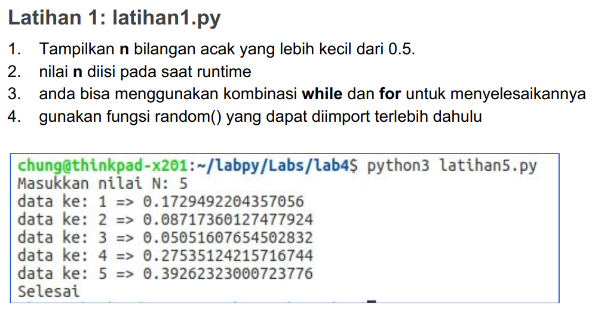

# Tugas Pertemuan 7 - Praktikum 3 - p7_labpy03
Repository ini dibuat untuk memenuhi Tugas Bahasa Pemrograman - Pertemuan 7 - Praktikum 3

Nama : Febro Herdyanto 
NIM : 312010043 
Kelas : TI.20.B.1 

## Daftar Isi
| No | Description | Hyperlink |
| --- | --- | --- |
| 1 | Tugas Latihan 1 | [Click Here](#tugas-latihan-1) |
| 2 | Tugas Latihan 2 | [Click Here](#tugas-latihan-2) |
| 3 | Tugas Program 1 | [Click Here](#tugas-program-1) |

Pada pertemuan 7 ini saya diberi tugas oleh Dosen untuk mempelajari dan membuat program sederhana dengan Bahasa Pemrograman Python 

## Tugas Latihan 1

* Pada tugas kali ini saya diminta dosen untuk mengerjakan tugas **latihan1.py**, seperti gambar dibawah ini : 
 

## Tugas Latihan 2

## Tugas Program 1
